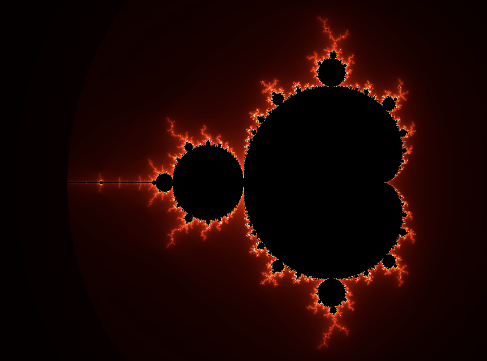

# Next Fractals - Interactive Mandelbrot Set Generator

A modern, interactive web application for exploring the infinite beauty of the Mandelbrot set, built with Next.js 14 and TypeScript.



## Overview

Next Fractals is a real-time fractal generator that allows users to explore the Mandelbrot set with smooth zoom controls, customizable parameters, and preset configurations. The application leverages Web Workers for performant fractal calculations and provides an intuitive interface for mathematical visualization.

## Features

### 🎨 Interactive Visualization
- **Real-time Rendering**: Smooth fractal generation with optimized performance
- **Zoom Controls**: Seamless zooming with mouse wheel and touch gestures
- **Pan Navigation**: Click and drag to explore different regions
- **Center Controls**: Precise positioning with coordinate input

### ⚙️ Customizable Parameters
- **Iteration Control**: Adjust detail level with iteration sliders
- **Color Mapping**: Dynamic color schemes for enhanced visualization
- **Parameter Presets**: Quick access to interesting fractal configurations
- **Custom Presets**: Save and manage your own configurations

### 🚀 Technical Features
- **Web Worker Integration**: Non-blocking fractal calculations
- **Fractal Caching**: Optimized performance with intelligent caching
- **Responsive Design**: Works seamlessly across desktop and mobile devices
- **TypeScript**: Full type safety and enhanced developer experience

## Technology Stack

- **Framework**: [Next.js 14](https://nextjs.org/) with App Router
- **Language**: [TypeScript](https://www.typescriptlang.org/)
- **Styling**: [Tailwind CSS](https://tailwindcss.com/)
- **Performance**: Web Workers for background calculations
- **UI Components**: Custom React components with modern design

## Getting Started

### Prerequisites

- Node.js 18.0 or later
- npm or yarn package manager

### Installation

1. Clone the repository:
```bash
git clone https://github.com/sloanahrens/next-fractals.git
cd next-fractals
```

2. Install dependencies:
```bash
npm install
```

3. Run the development server:
```bash
npm run dev
```

4. Open [http://localhost:3000](http://localhost:3000) in your browser to start exploring!

## Usage

### Basic Navigation
- **Zoom In/Out**: Use mouse wheel or zoom controls
- **Pan**: Click and drag to move around the fractal
- **Reset**: Use preset configurations to jump to interesting locations

### Advanced Features
- **Custom Presets**: Create and save your own fractal configurations
- **Parameter Adjustment**: Fine-tune iterations and other settings
- **Export**: Save your discoveries as images or configuration files

## Project Structure

```
src/
├── app/                    # Next.js App Router pages
│   ├── layout.tsx         # Root layout with meta tags
│   ├── page.tsx           # Main fractal viewer page
│   └── globals.css        # Global styles
├── components/
│   └── ui/                # Reusable UI components
│       ├── Button.tsx
│       ├── Slider.tsx
│       ├── PresetSelector.tsx
│       └── ...
├── hooks/                 # Custom React hooks
│   ├── useFractalWorker.ts
│   └── useViewportSize.ts
├── lib/                   # Core logic and utilities
│   ├── mandelbrot.ts      # Mandelbrot set calculations
│   ├── fractalRenderer.ts # Rendering engine
│   ├── colorMapping.ts    # Color scheme utilities
│   └── presets.ts         # Preset configurations
├── types/                 # TypeScript type definitions
├── workers/               # Web Worker implementations
└── public/                # Static assets
```

## Mathematics Behind the Magic

The Mandelbrot set is defined by the iterative formula:

```
z₀ = 0
z_{n+1} = z_n² + c
```

Where `c` is a complex number representing each pixel's coordinate. Points that don't diverge to infinity after a maximum number of iterations are considered part of the set.

## Performance Optimization

- **Web Workers**: Fractal calculations run in background threads
- **Intelligent Caching**: Previously calculated regions are cached for instant display
- **Progressive Rendering**: Lower resolution previews while calculating high-resolution results
- **Memory Management**: Efficient canvas and data structure handling

## Contributing

Contributions are welcome! Please feel free to submit a Pull Request. For major changes, please open an issue first to discuss what you would like to change.

## License

This project is licensed under the MIT License - see the [LICENSE](LICENSE) file for details.

## Acknowledgments

- Inspired by the mathematical beauty of Benoit Mandelbrot's work
- Built with modern web technologies for optimal performance
- Designed for both mathematical exploration and visual enjoyment

## Deployment

### 🚀 Quick Deploy to GCP Cloud Run

Deploy Next Fractals to Google Cloud Platform using our containerized deployment system:

```bash
# Quick setup
export GCP_PROJECT="your-project-id"
./deploy.sh build
./deploy.sh auth
./deploy.sh deploy
```

**📚 Deployment Documentation:**
- **[🆕 GCP Account Setup](docs/GCP_SETUP.md)** - New to Google Cloud? Start here!
- **[Terraform Infrastructure](terraform/README.md)** - Infrastructure as Code for GCP Cloud Run
- **[TF-DevOps Container](tf-devops/README.md)** - Containerized deployment toolkit
- **[Developer Guide](CLAUDE.md)** - Development setup and architecture overview

### Alternative Deployments

- **Vercel**: Deploy directly from GitHub with zero configuration
- **Netlify**: Static export with `npm run build && npm run export`
- **Docker**: Use the included `Dockerfile` for any container platform

---

**Explore the infinite complexity of mathematics through interactive visualization.**

🌐 **Live on Netlify**: [Next Fractals](https://nextjs-fractals.netlify.app/)  
🚀 **Deploy to GCP**: See [deployment guides](terraform/README.md) above
